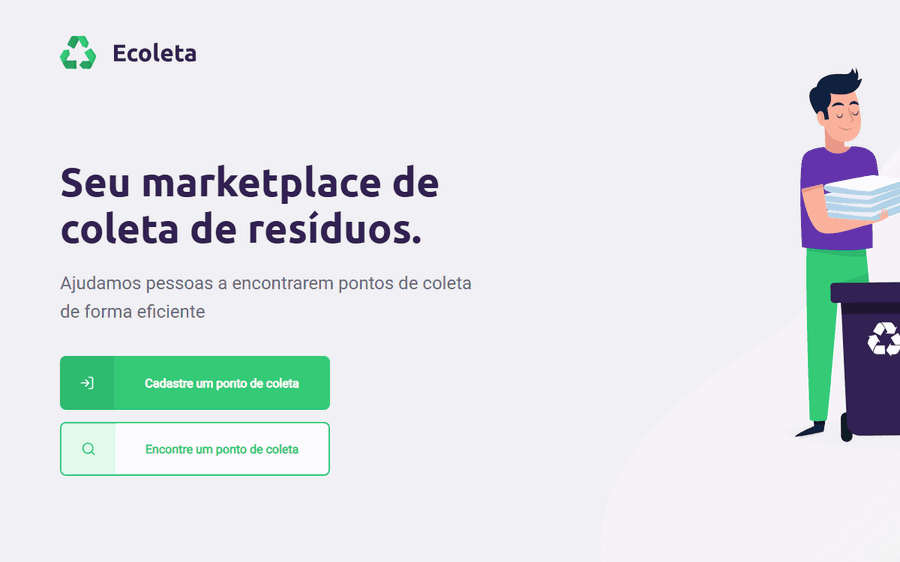

# Ecoleta

Cadastro e busca de pontos de coleta de resíduos, com API em Node, Express e SQLite e front-end em React com TypeScript e mapa do Leaflet.

Fiz em 2020 durante a Next Level Week 1 da Rocketseat. Em 2026 voltei a ele: atualizei as dependências, que não instalavam mais, troquei o Create React App pelo Vite, corrigi os bugs, adicionei o upload da imagem do ponto, a página de busca e os testes automatizados, e organizei o código. A pasta do app mobile, que nunca passou do template do Expo, saiu do repositório.

<p align="center">
  
</p>

## Como rodar

Precisa de Node 20.19, 22.12 ou mais novo, e do Yarn. São dois projetos, cada um no seu terminal.

### Servidor

```bash
cd server
```

```bash
yarn
```

Na primeira vez, crie o banco e cadastre os itens de coleta:

```bash
yarn knex:migrate
```

```bash
yarn knex:seed
```

```bash
yarn start
```

A API fica em http://localhost:3333. A porta pode ser trocada pela variável `PORT`.

### Web

```bash
cd web
```

```bash
yarn
```

```bash
yarn dev
```

Depois abra http://localhost:5173. Se a API estiver em outro endereço, defina `VITE_API_URL` (por exemplo, num arquivo `web/.env.local`).

Outros comandos:

| Onde | Comando | O que faz |
|---|---|---|
| server | `yarn test` | Roda os testes da API com um banco temporário |
| server | `yarn typecheck` | Confere os tipos com o TypeScript |
| web | `yarn test` | Roda os testes das páginas |
| web | `yarn build` | Confere os tipos e gera a versão de produção na pasta `dist` |
| web | `yarn preview` | Serve a pasta `dist` localmente |
| web | `yarn lint` | Roda o ESLint |

## Recursos

- Cadastro do ponto com nome, e-mail, WhatsApp, imagem, localização no mapa, UF, cidade e itens coletados
- Busca por UF, cidade e itens, com os pontos no mapa e em cards, e detalhe com links para WhatsApp e e-mail
- Imagem por clique ou arrastando o arquivo, com prévia. JPG, PNG ou WebP de até 5 MB
- UFs e cidades carregadas da API de localidades do IBGE
- Mapa centralizado na posição do usuário, ou no centro do Brasil quando a geolocalização é negada
- Validação no formulário e na API, com mensagem do que falta
- Tela de confirmação depois do cadastro, voltando para a home em 2 segundos, e botão desabilitado enquanto o envio não termina
- Itens de coleta selecionáveis pelo teclado (Tab, Espaço e Enter)
- Layout adaptado a telas pequenas

### API

| Rota | O que faz |
|---|---|
| `GET /items` | Lista os 6 itens de coleta, com a URL do ícone |
| `GET /points?uf=DF&city=Brasília&items=1,2` | Lista os pontos. Cada filtro é opcional |
| `GET /points/:id` | Ponto e títulos dos itens que ele coleta. 404 se não existir |
| `POST /points` | Cadastra um ponto (multipart, imagem no campo `image`, itens separados por vírgula). 201 com o ponto criado, 400 com a lista de erros |

## Como o código funciona

```
server/
├── knexfile.ts                     configuração do SQLite, usada pelo servidor e pela CLI do knex
├── uploads/                        ícones dos itens; as imagens dos pontos vão em uploads/points
├── tests/api.test.ts               testes das rotas com banco temporário
└── src/
    ├── app.ts                      Express, arquivos estáticos e middleware de erro
    ├── server.ts                   sobe o app na porta 3333 ou em PORT
    ├── routes.ts                   rotas de itens e pontos
    ├── controllers/                ItemsController e PointsController
    ├── validations/point.ts        converte e valida o corpo do cadastro
    ├── config/multer.ts            upload da imagem: tipo, tamanho e nome do arquivo
    ├── middlewares/errorHandler.ts transforma erros em respostas 400 e 500 em JSON
    ├── errors/HttpError.ts         erro com status HTTP
    ├── utils/uploadsUrl.ts         URL pública de um arquivo em uploads
    └── database/                   conexão, migrations e seed dos itens

web/
├── index.html                      página base; o Vite injeta o src/main.tsx
└── src/
    ├── routes.tsx                  / (home), /create-point (cadastro) e /points (busca)
    ├── services/api.ts             axios apontando para a API
    ├── services/ibge.ts            UFs e cidades do IBGE
    ├── hooks/                      useItems (itens de coleta) e useIbgeLocations (UFs e cidades)
    ├── components/Dropzone/        escolha da imagem com prévia
    ├── components/ItemsGrid/       grade de itens selecionáveis, usada no cadastro e na busca
    ├── components/LocationSelect/  selects de UF e cidade
    ├── components/MapController/   clique no mapa e posição do mapa
    ├── test/mocks.tsx              dublês da API, do IBGE e do react-leaflet para os testes
    └── pages/                      Home, CreatePoint e SearchPoints, cada uma com seus testes
```

- **Cadastro.** `parsePoint()` converte os campos do multipart, que chegam como texto, e devolve o ponto tipado ou a lista de erros. O ponto e os vínculos com os itens são gravados em `knex.transaction()`, que faz o commit ou o rollback sozinho. Se o cadastro for recusado ou falhar, a imagem enviada é apagada.
- **Erros.** Os controllers respondem os casos esperados (400 e 404) e não têm `try/catch` para o resto. O Express 5 encaminha qualquer erro de função `async` para o `errorHandler`, que responde em JSON.
- **URLs das imagens.** `uploadsUrl()` monta o endereço com o host da requisição, então a imagem abre tanto em `localhost` quanto pelo IP da máquina na rede.
- **Formulário.** `validateForm()` confere imagem, UF, cidade, posição e itens antes do envio, e a mensagem do servidor aparece quando ele recusa o cadastro. Trocar a UF limpa a cidade, e a resposta de cidades de uma UF anterior é descartada.
- **Busca.** A página chama `GET /points` quando UF e cidade estão escolhidas, e de novo a cada item marcado. O resultado guarda a combinação de filtros que o gerou, e só aparece enquanto ela for a atual.
- **Mapa.** O `MapContainer` do react-leaflet só usa `center` e `zoom` na montagem. O `MapController` reposiciona o mapa quando a view muda: no cadastro, quando a geolocalização responde; na busca, enquadrando todos os pontos encontrados.

## Revisitando o projeto em 2026

Seis anos depois, nenhuma das partes instalava. O `sqlite3` 4.2 não tem mais binário para baixar e a compilação falha no Node 24. O `react-scripts` 3.4 usa o webpack 4, que não roda nas versões atuais do Node. Depois de atualizar, a revisão encontrou dois bugs que derrubavam o servidor e um formulário que aceitava qualquer coisa.

### Bugs corrigidos

| Bug | Causa | Correção |
|---|---|---|
| `GET /points/:id` com id inexistente travava o servidor | A rota abria uma transação e não fechava quando o ponto não existia. O knex usa uma conexão só com o SQLite, e todas as requisições seguintes ficavam esperando | A rota não usa transação e responde 404 |
| Cadastro com erro também travava o servidor | A transação não tinha rollback | `knex.transaction()` com callback |
| Site mostrava "Ponto criado" quando o cadastro falhava | A API respondia erros com status 200 e `{ error: true }` | Status 400, 404 e 500 pelo `errorHandler` |
| Cadastro com UF "0", cidade "0", posição 0,0 e nenhum item | Não havia validação | `parsePoint()` na API e `validateForm()` no site |
| Ponto gravado com cidade de outra UF | Trocar a UF mantinha a cidade escolhida antes | `handleSelectUF()` limpa a cidade |
| Mapa aberto no meio do Atlântico | Sem geolocalização, a posição inicial era 0,0, com um marcador lá | Centro do Brasil como padrão e marcador só depois do clique |
| Latitude gravada como texto e cidade numa coluna numérica | Tipos trocados na migration | `double` para as coordenadas e `string` para a cidade |
| Ícones dos itens não abriam em outra máquina da rede | URL com `127.0.0.1:3333` fixo | `uploadsUrl()` usa o host da requisição |
| Todo ponto com a mesma foto | URL do Unsplash fixa no código | Upload da imagem |
| Rodar o seed de novo duplicava os itens | O seed inseria sem conferir o que já existia | O seed insere só os itens que faltam |
| Clique duplo em "Cadastrar" criava dois pontos | Nada impedia um segundo envio | `isSubmitting` desabilita o botão até a resposta |
| Lista de itens vazia sem aviso com a API fora do ar | O erro só ia para o console | Mensagem pedindo para recarregar a página |

### Decisões técnicas

**Atualização das dependências**

- Servidor: Express 5, knex 3, sqlite3 6 e multer 2. O `tsx` substituiu o `ts-node-dev`, que não tem versão nova desde 2022 e depende do `ts-node`, que por sua vez depende da API em JS do TypeScript, removida no TypeScript 7. As migrations do knex também rodam pelo `tsx`.
- Web: Vite 8 no lugar do Create React App, React 19, React Router 7, react-leaflet 5 e ESLint 10.
- TypeScript 6.0 nos dois. O 7 já existe, mas o `typescript-eslint` ainda não aceita.
- O banco SQLite deixou de ser versionado. Ele é criado pelas migrations e pelo seed.

**Upload da imagem**

A imagem vai no mesmo `POST /points` dos dados, em multipart, para o cadastro continuar sendo uma requisição só. O arquivo recebe um nome aleatório (`crypto.randomUUID()`), com a extensão tirada do tipo do arquivo e não do nome enviado.

**Página de busca no lugar do app mobile**

As rotas `GET /points` e `GET /points/:id` foram feitas para o app mobile, que nunca saiu do template. A busca foi para o site, com os mesmos filtros que o app teria. O número do WhatsApp sem código de país ganha o 55 no link.

**Testes**

- API: o app sobe numa porta livre com um banco SQLite temporário (`DATABASE_FILE`), e os testes usam `fetch` como um cliente de verdade, com upload e tudo.
- Web: Vitest com jsdom e Testing Library. A API, o IBGE e o react-leaflet são substituídos por dublês, então os testes não dependem de rede nem de mapa.

**Organização do código**

- **Responsabilidades separadas.** Validação, configuração do upload, tratamento de erro e chamadas ao IBGE saíram dos controllers e da página para arquivos próprios.
- **Configuração única do banco.** A conexão usa o `knexfile`, que antes era repetido em `connection.ts`.
- **Nomes corrigidos.** `hundle*` virou `handle*`, `persedItems` virou `parsedItems`, e a migration `02_creat_poinst_items` virou `02_create_points_items`.
- **Código compartilhado entre as páginas.** Itens, UFs e cidades e a grade de itens viraram hooks e componentes usados pelo cadastro e pela busca.
- **Mesmo resultado.** Conferi a organização com um roteiro de 25 verificações da API e 8 cenários do formulário, rodados antes e depois, com saídas idênticas. Esses cenários viraram os testes que estão hoje no repositório.
