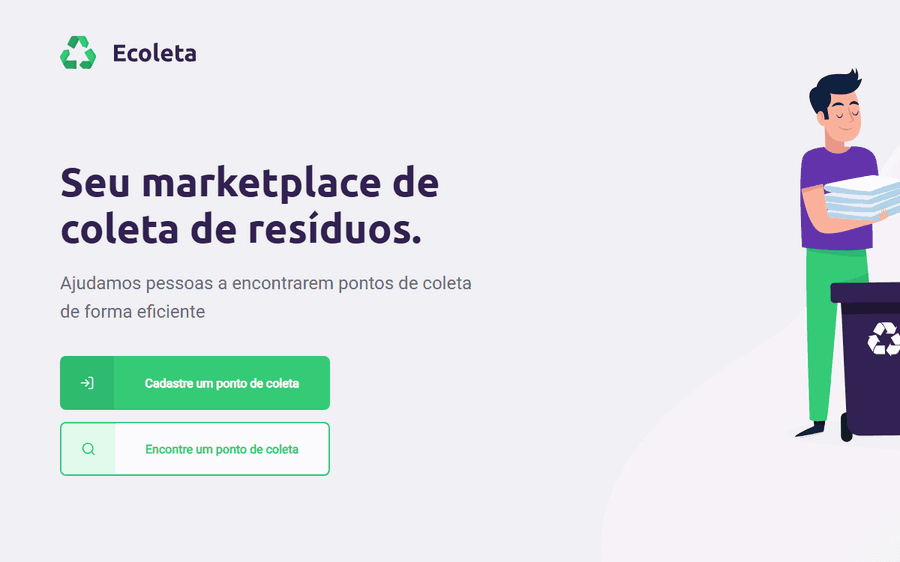

# ♻️ Ecoleta

<div align="center">
  
  
  
  
  
  
  
  
</div>

<br>

> 🎯 **Cadastro e busca de pontos de coleta de resíduos**, com API em Node, Express e SQLite e front-end em React com TypeScript e mapa do Leaflet.

Fiz em 2020 durante a Next Level Week 1 da Rocketseat. Em 2026 voltei a ele: nada instalava mais. Atualizei as dependências, troquei o Create React App pelo Vite, corrigi os bugs, adicionei o upload da imagem, a página de busca e os testes, e tirei a pasta do app mobile, que nunca passou do template do Expo.

<p align="center">
  
</p>

## 📋 Índice

- [🎓 O que aprendi](#-o-que-aprendi)
- [🚀 Como rodar](#-como-rodar)
- [🧠 Decisões técnicas](#-decisões-técnicas)
- [🔄 Revisitando o projeto em 2026](#-revisitando-o-projeto-em-2026)
- [📄 Licença](#-licença)

## 🎓 O que aprendi

- **Projeto parado apodrece.** Seis anos depois, nenhuma das partes instalava: o `sqlite3` 4.2 não tem mais binário para o Node 24, e o `react-scripts` 3.4 usa um webpack que não roda nas versões atuais do Node.
- **Transação aberta trava tudo.** A busca de um ponto inexistente abria uma transação e não fechava. Com o SQLite, o knex usa uma conexão só, e todas as requisições seguintes ficavam esperando. O `knex.transaction()` com callback faz o commit ou o rollback sozinho.
- **O status HTTP faz parte do contrato.** A API respondia erro com status 200 e `{ error: true }`, e o site mostrava "Ponto criado" quando o cadastro falhava.
- **Formulário precisa de validação dos dois lados e de estado coerente.** O cadastro aceitava UF "0", posição 0,0 e nenhum item, e trocar a UF mantinha a cidade da UF anterior. Hoje a API valida com `parsePoint()` e o site com `validateForm()`.
- **Componente de terceiro tem regras de ciclo de vida.** O `MapContainer` do react-leaflet só usa `center` e `zoom` na montagem, então reposicionar o mapa depois exigiu o `MapController`.
- **Refatorar com prova, e a prova vira teste.** Rodei 25 verificações da API e 8 cenários do formulário antes e depois da reorganização, com saídas idênticas. Esses cenários viraram os testes do repositório.

## 🚀 Como rodar

Precisa de Node 20.19, 22.12 ou mais novo, e do Yarn. São dois projetos, cada um no seu terminal.

```bash
cd server && yarn && yarn knex:migrate && yarn knex:seed   # primeira vez: dependências, banco e itens de coleta
cd server && yarn start                                    # API em http://localhost:3333
cd web && yarn && yarn dev                                 # site em http://localhost:5173
```

| Rota | O que faz |
|---|---|
| `GET /items` | Lista os 6 itens de coleta |
| `GET /points?uf=DF&city=Brasília&items=1,2` | Lista os pontos; cada filtro é opcional |
| `GET /points/:id` | Ponto e os itens que ele coleta |
| `POST /points` | Cadastra um ponto, com a imagem em multipart |

Os testes rodam com `yarn test` em cada pasta, sem rede: a API usa um banco temporário, e o site, dublês da API, do IBGE e do mapa.

## 🧠 Decisões técnicas

| Decisão | Alternativa | Por quê |
|---|---|---|
| Vite | Create React App | O `react-scripts` 3.4 não roda no Node atual, e o CRA parou |
| `tsx` | `ts-node-dev` | O `ts-node-dev` não tem versão nova desde 2022 e depende de uma API removida no TypeScript 7 |
| TypeScript 6 | TypeScript 7 | O `typescript-eslint` ainda não aceita a 7 |
| Imagem no mesmo `POST /points`, em multipart | Upload numa rota separada | O cadastro continua sendo uma requisição só |
| Nome de arquivo aleatório, extensão tirada do tipo | Nome enviado pelo usuário | Evita colisão e arquivo com extensão falsa |
| Página de busca no site | App mobile | As rotas de busca foram feitas para um app que nunca saiu do template |
| Banco criado pelas migrations e pelo seed | Banco SQLite versionado | O arquivo do banco não precisa ir para o Git |

## 🔄 Revisitando o projeto em 2026

Depois de atualizar, a revisão encontrou dois bugs que derrubavam o servidor e um formulário que aceitava qualquer coisa. Dos 12 bugs corrigidos, os principais:

| O que estava errado | O que mudou |
|---|---|
| Buscar um ponto inexistente travava o servidor | A rota não usa transação e responde 404 |
| Cadastro com erro também travava o servidor | `knex.transaction()` com callback, que faz o rollback |
| O site mostrava "Ponto criado" quando o cadastro falhava | Erros com status 400, 404 e 500 pelo `errorHandler` |
| Cadastro sem UF, cidade, posição nem itens | Validação na API e no site |
| Clique duplo em "Cadastrar" criava dois pontos | O botão fica desabilitado até a resposta |

## 📄 Licença

[MIT](LICENSE)

---

<div align="center">
  <p>Desenvolvido por <strong>Luiz Matos</strong></p>
  <p>
    <a href="https://github.com/luiz-matos">GitHub</a> •
    <a href="https://www.linkedin.com/in/luizeduardomatos/">LinkedIn</a>
  </p>
</div>
